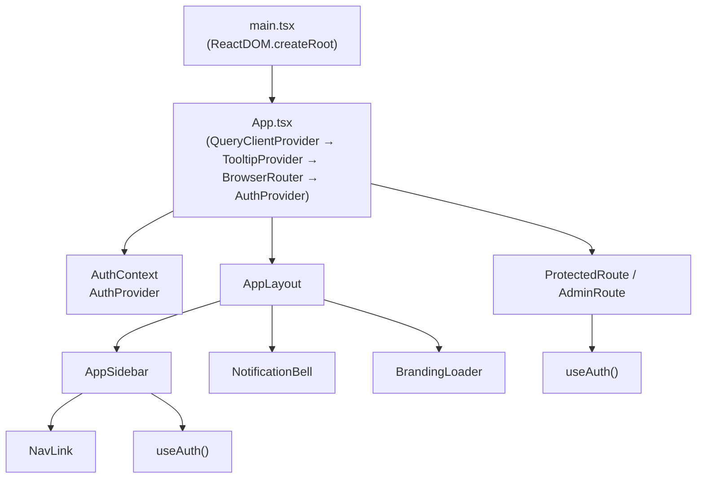
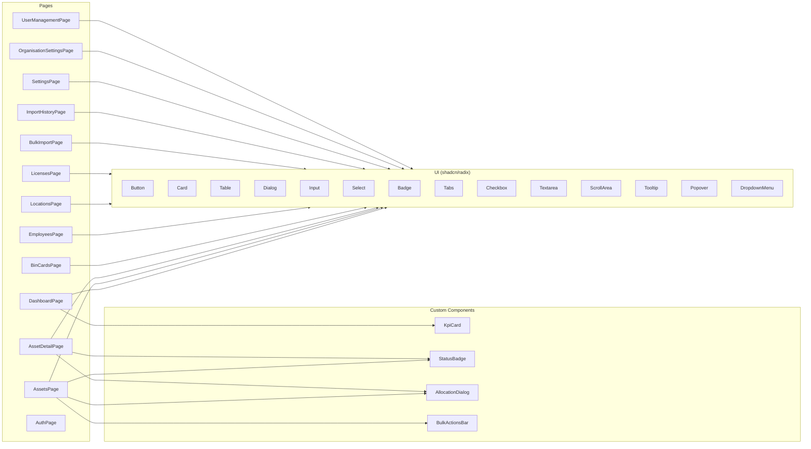
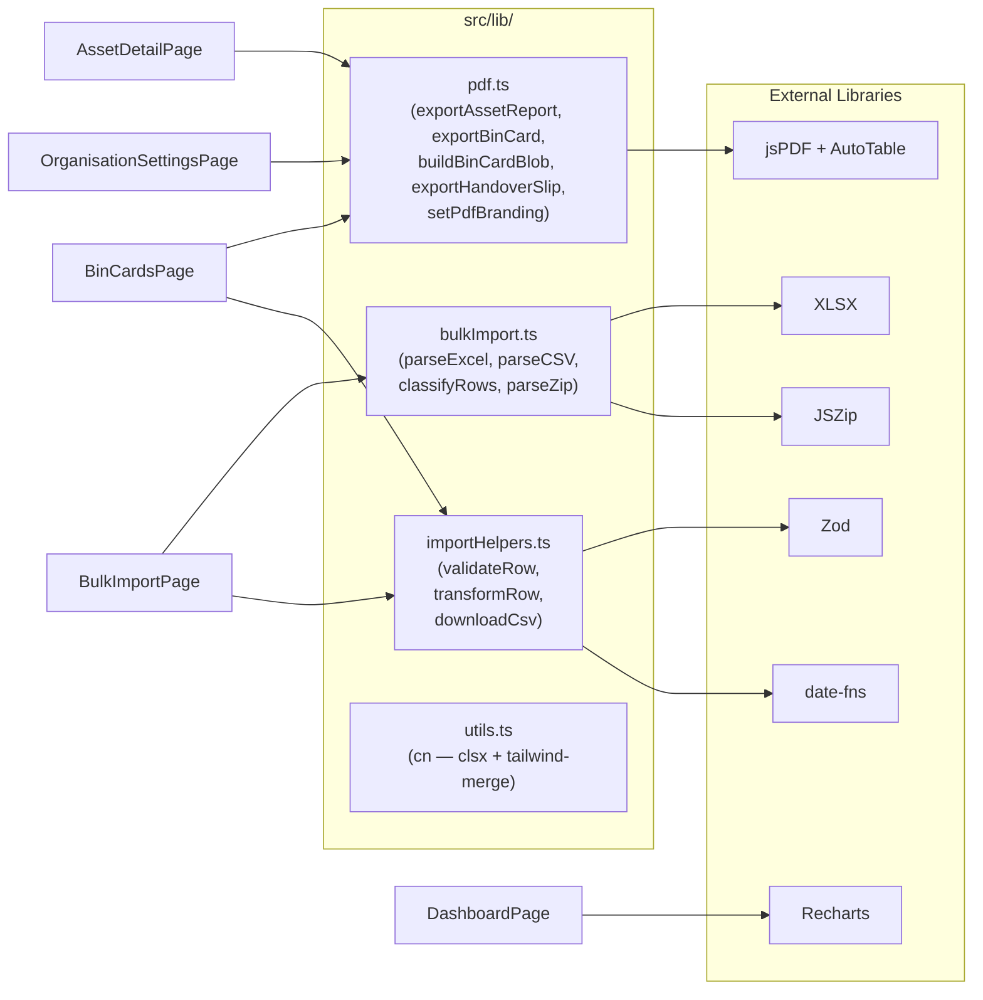
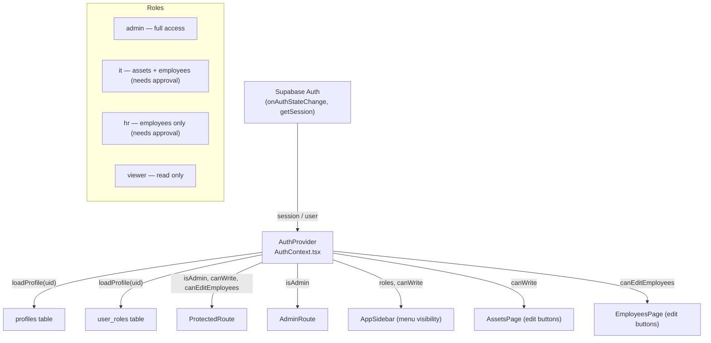
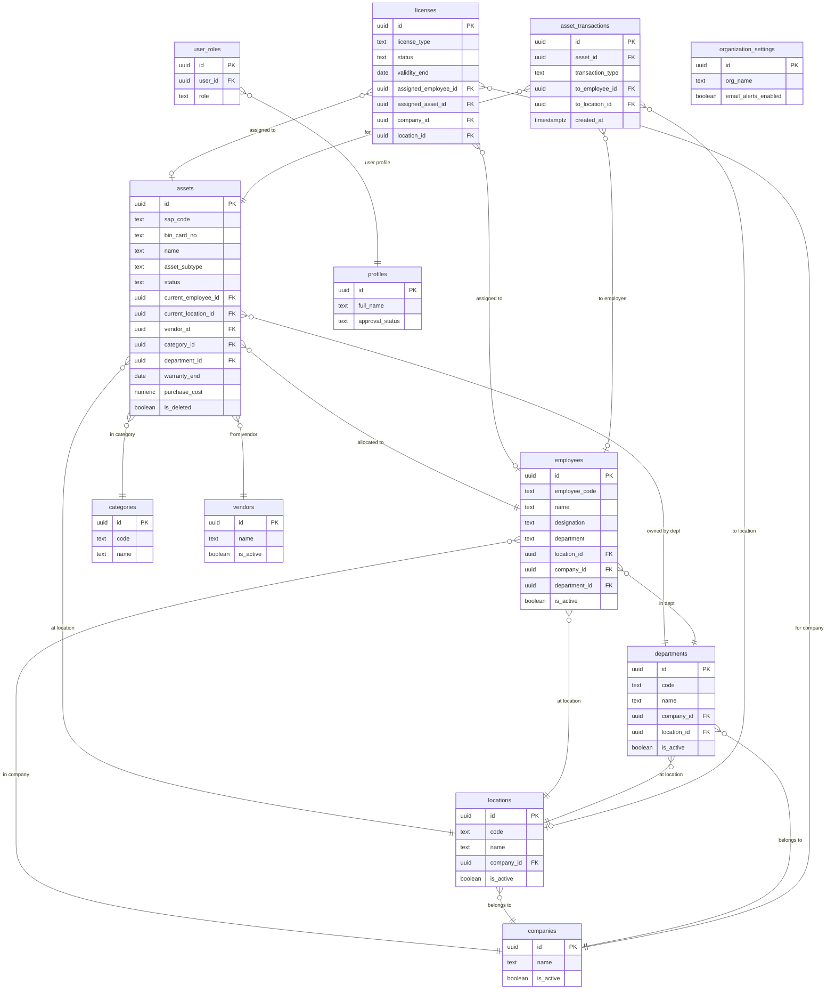
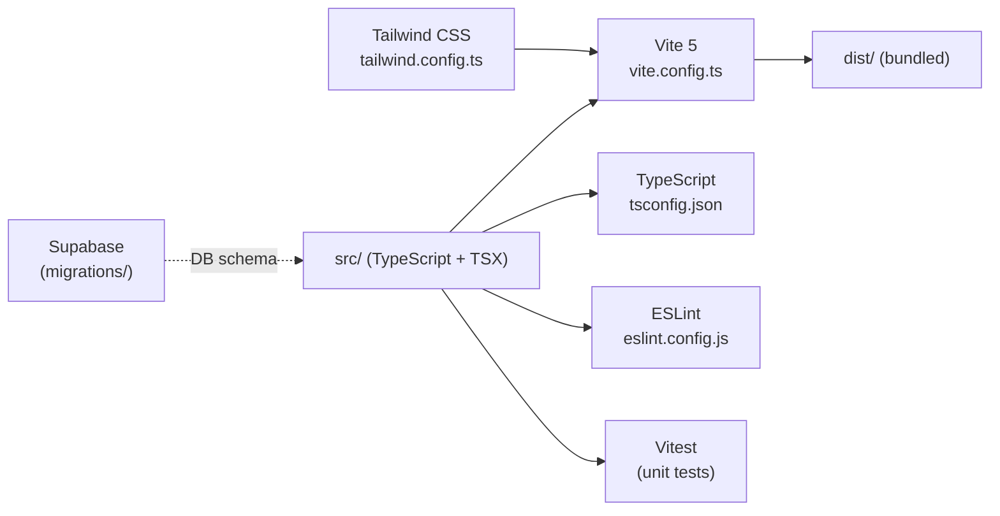

# Asset Harmony — Code Review Graph

## 1. Application Entry & Provider Tree



---

## 2. Page → Component Dependency Graph



---

## 3. Data Flow: Pages → Hooks → Supabase → DB

```mermaid
graph TD
    subgraph Pages
        Dashboard2["DashboardPage"]
        Assets2["AssetsPage"]
        AssetDetail2["AssetDetailPage"]
        Employees2["EmployeesPage"]
        Locations2["LocationsPage"]
        Licenses2["LicensesPage"]
        BinCards2["BinCardsPage"]
        Settings2["SettingsPage / OrgSettings"]
        UserMgmt2["UserManagementPage"]
        BulkImport2["BulkImportPage"]
    end

    subgraph Hooks["src/hooks/useSupabaseData.ts"]
        useDashboardStats
        useAssets / useAsset / useCreateAsset / useUpdateAsset
        useEmployees / useCreateEmployee / useUpdateEmployee
        useLocations / useCreateLocation
        useLicenses / useCreateLicense / useUpdateLicense
        useCategories / useCreateCategory
        useVendors / useCreateVendor
        useDepartments / useCreateDepartment
        useCompanies / useCreateCompany
        useAssetTransactions / useCreateTransaction
        useOrgSettings / useUpdateOrgSettings
    end

    subgraph Auth["src/hooks / contexts"]
        useAuth["useAuth() — AuthContext"]
        useNotifications["useNotifications()"]
    end

    subgraph SupabaseLayer["src/integrations/supabase"]
        SupabaseClient["client.ts\n(createClient)"]
        DBTypes["types.ts\n(Database — 1053 lines)"]
    end

    subgraph DB["Supabase PostgreSQL"]
        assets_table["assets"]
        employees_table["employees"]
        locations_table["locations"]
        licenses_table["licenses"]
        companies_table["companies"]
        categories_table["categories"]
        vendors_table["vendors"]
        departments_table["departments"]
        transactions_table["asset_transactions"]
        profiles_table["profiles"]
        roles_table["user_roles"]
        org_table["organization_settings"]
    end

    Dashboard2 --> useDashboardStats
    Assets2 --> useAssets / useAsset / useCreateAsset / useUpdateAsset
    AssetDetail2 --> useAssets / useAsset / useCreateAsset / useUpdateAsset
    AssetDetail2 --> useAssetTransactions / useCreateTransaction
    Employees2 --> useEmployees / useCreateEmployee / useUpdateEmployee
    Locations2 --> useLocations / useCreateLocation
    Licenses2 --> useLicenses / useCreateLicense / useUpdateLicense
    Settings2 --> useOrgSettings / useUpdateOrgSettings
    Settings2 --> useCompanies / useCreateCompany
    Settings2 --> useCategories / useCreateCategory
    Settings2 --> useVendors / useCreateVendor
    BulkImport2 --> SupabaseClient

    Hooks --> SupabaseClient
    Auth --> SupabaseClient
    SupabaseClient --> DB
    DBTypes -.->|"TypeScript types"| Hooks
```

---

## 4. Utility / Library Layer



---

## 5. Authentication & RBAC Flow



---

## 6. Database Schema Relations



---

## 7. Build & Deployment Pipeline



---

## 8. Module Summary Table

| Layer | Files | Responsibility |
|-------|-------|----------------|
| **Entry** | `main.tsx`, `App.tsx` | Bootstrap React, providers, routing |
| **Auth** | `AuthContext.tsx`, `ProtectedRoute.tsx` | Session, RBAC, route guards |
| **Pages** (15) | `src/pages/*.tsx` | Feature views & business logic |
| **Custom Components** (8) | `src/components/*.tsx` | Reusable UI (Sidebar, AllocationDialog, etc.) |
| **UI Primitives** (50+) | `src/components/ui/` | shadcn/radix components |
| **Data Hooks** | `useSupabaseData.ts` | All CRUD via React Query + Supabase |
| **Realtime Hook** | `useNotifications.ts` | Live notification feed |
| **Utilities** | `src/lib/pdf.ts`, `bulkImport.ts`, `importHelpers.ts`, `utils.ts` | PDF gen, bulk parsing, helpers |
| **Supabase Client** | `integrations/supabase/client.ts` | Single Supabase instance |
| **DB Types** | `integrations/supabase/types.ts` | Auto-generated TS types (1053 lines) |
| **Database** | `supabase/migrations/` (7 files) | Schema evolution (Apr 11–22 2026) |
