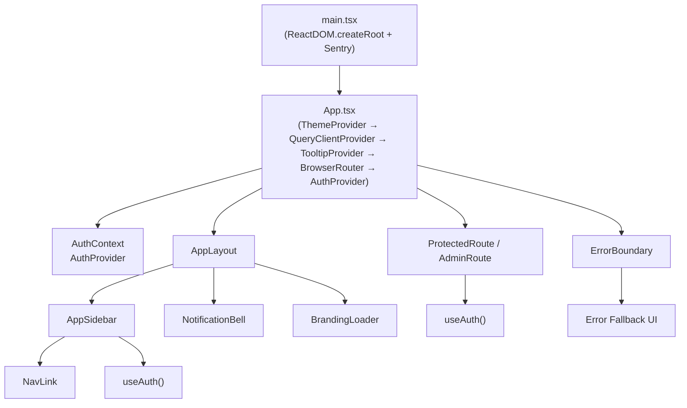
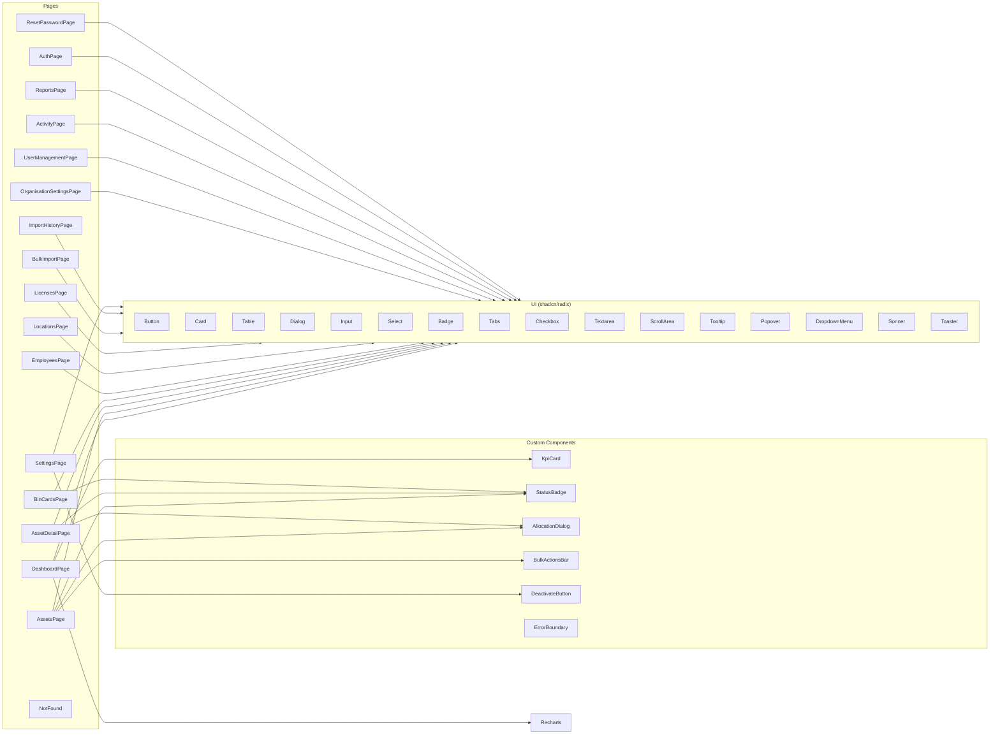
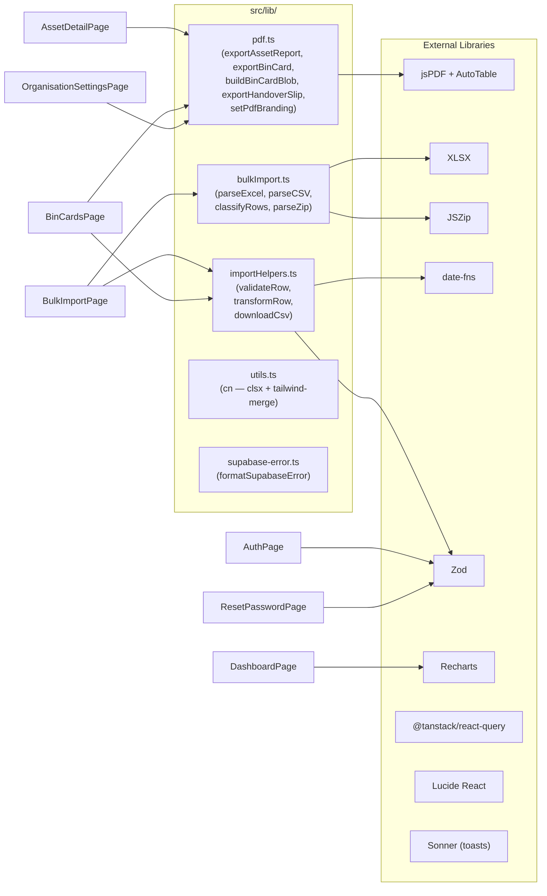
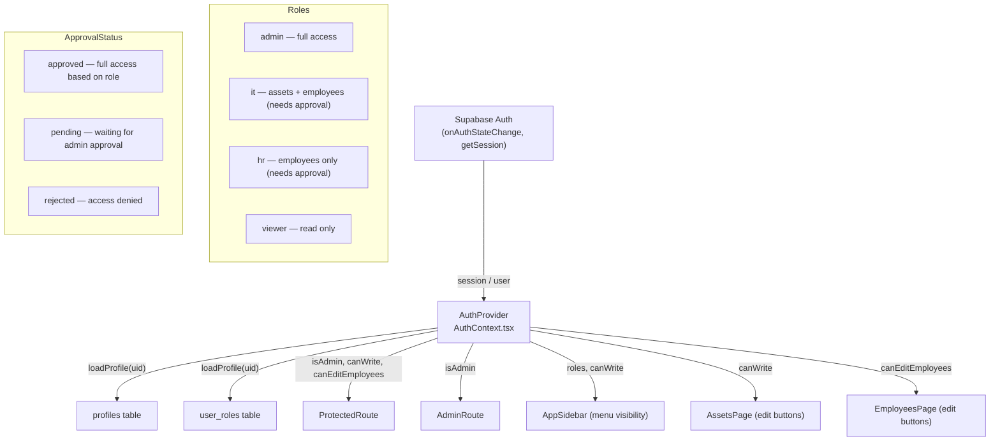
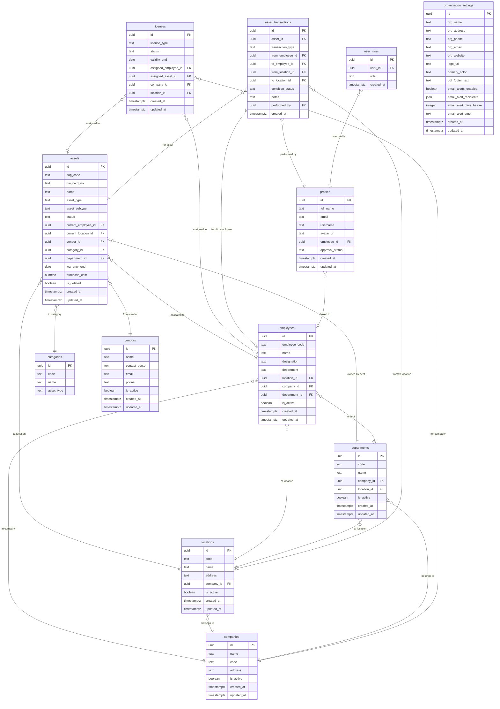
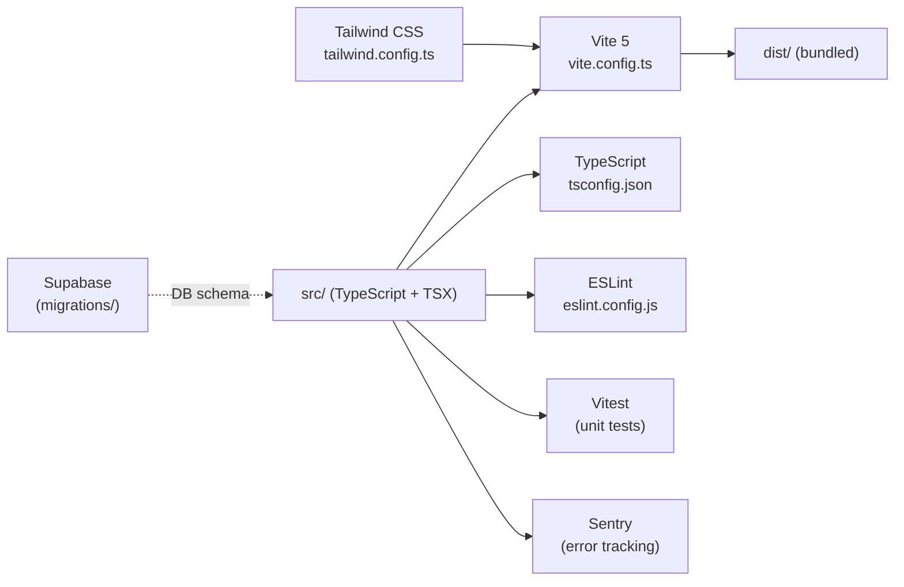

# Asset Harmony — Updated Code Review Graph

## 1. Application Entry & Provider Tree



---

## 2. Page → Component Dependency Graph



---

## 3. Data Flow: Pages → Hooks → Supabase → DB

```mermaid
graph TD
    subgraph Pages
        Dashboard2["DashboardPage"]
        Assets2["AssetsPage"]
        AssetDetail2["AssetDetailPage"]
        Employees2["EmployeesPage"]
        Locations2["LocationsPage"]
        Licenses2["LicensesPage"]
        BinCards2["BinCardsPage"]
        Settings2["SettingsPage / OrgSettings"]
        UserMgmt2["UserManagementPage"]
        BulkImport2["BulkImportPage"]
        Activity2["ActivityPage"]
        Reports2["ReportsPage"]
    end

    subgraph Hooks["src/hooks/useSupabaseData.ts"]
        useDashboardStats
        useAssets / useAsset / useCreateAsset / useUpdateAsset / useDeleteAsset
        useEmployees / useCreateEmployee / useUpdateEmployee / useDeactivateEmployee
        useLocations / useCreateLocation / useUpdateLocation
        useLicenses / useCreateLicense / useUpdateLicense
        useCategories / useCreateCategory / useDeleteCategory
        useVendors / useCreateVendor / useDeactivateVendor
        useDepartments / useCreateDepartment
        useCompanies / useCreateCompany / useDeactivateCompany
        useAssetTransactions / useCreateTransaction
        useOrgSettings / useUpdateOrgSettings
    end

    subgraph Auth["src/hooks / contexts"]
        useAuth["useAuth() — AuthContext"]
        useNotifications["useNotifications()"]
        useToast["useToast()"]
    end

    subgraph SupabaseLayer["src/integrations/supabase"]
        SupabaseClient["client.ts\n(createClient + env validation)"]
        DBTypes["types.ts\n(Database — 1054 lines)"]
        SupabaseError["supabase-error.ts"]
    end

    subgraph DB["Supabase PostgreSQL"]
        assets_table["assets"]
        employees_table["employees"]
        locations_table["locations"]
        licenses_table["licenses"]
        companies_table["companies"]
        categories_table["categories"]
        vendors_table["vendors"]
        departments_table["departments"]
        transactions_table["asset_transactions"]
        profiles_table["profiles"]
        roles_table["user_roles"]
        org_table["organization_settings"]
    end

    Dashboard2 --> useDashboardStats
    Assets2 --> useAssets / useAsset / useCreateAsset / useUpdateAsset / useDeleteAsset
    AssetDetail2 --> useAssets / useAsset / useCreateAsset / useUpdateAsset
    AssetDetail2 --> useAssetTransactions / useCreateTransaction
    Employees2 --> useEmployees / useCreateEmployee / useUpdateEmployee / useDeactivateEmployee
    Locations2 --> useLocations / useCreateLocation / useUpdateLocation
    Licenses2 --> useLicenses / useCreateLicense / useUpdateLicense
    Settings2 --> useOrgSettings / useUpdateOrgSettings
    Settings2 --> useCompanies / useCreateCompany / useDeactivateCompany
    Settings2 --> useCategories / useCreateCategory / useDeleteCategory
    Settings2 --> useVendors / useCreateVendor / useDeactivateVendor
    BulkImport2 --> SupabaseClient
    Activity2 --> useAssetTransactions
    Reports2 --> useAssets / useEmployees / useLicenses

    Hooks --> SupabaseClient
    Auth --> SupabaseClient
    SupabaseClient --> DB
    SupabaseError -.->|"Error handling"| Hooks
    DBTypes -.->|"TypeScript types"| Hooks
```

---

## 4. Utility / Library Layer



---

## 5. Authentication & RBAC Flow



---

## 6. Database Schema Relations



---

## 7. Build & Deployment Pipeline



---

## 8. Security & Error Handling

```mermaid
graph TD
    subgraph Security
        EnvValidation["Environment Variable Validation"]
        RLS["Row Level Security Policies"]
        RBAC["Role-Based Access Control"]
        ApprovalSystem["User Approval System"]
    end

    subgraph ErrorHandling
        ErrorBoundary["React Error Boundary"]
        SupabaseErrorHandling["formatSupabaseError"]
        ToastNotifications["Sonner Toasts"]
        ConsoleLogging["Console Error Logging"]
    end

    subgraph Validation
        ZodSchemas["Zod Validation Schemas"]
        FormValidation["React Hook Form"]
        TypeSafety["TypeScript Types"]
    end

    EnvValidation --> client_ts["client.ts"]
    RLS --> supabase_policies["Database Policies"]
    RBAC --> AuthContext["AuthContext"]
    ApprovalSystem --> ProtectedRoute["ProtectedRoute"]

    ErrorBoundary --> App["App.tsx"]
    SupabaseErrorHandling --> useSupabaseData["useSupabaseData.ts"]
    ToastNotifications --> Pages["All Pages"]
    ConsoleLogging --> ErrorBoundary

    ZodSchemas --> AuthPage["AuthPage"]
    ZodSchemas --> ResetPassword["ResetPasswordPage"]
    FormValidation --> Forms["All Forms"]
    TypeSafety --> EntireApp["Entire Application"]
```



---

## 9. Module Summary Table

| Layer | Files | Responsibility | Key Features |
|-------|-------|----------------|--------------|
| **Entry** | `main.tsx`, `App.tsx` | Bootstrap React, providers, routing | Sentry integration, lazy loading |
| **Auth** | `AuthContext.tsx`, `ProtectedRoute.tsx` | Session, RBAC, route guards | Approval system, role-based access |
| **Pages** (17) | `src/pages/*.tsx` | Feature views & business logic | Dashboard, assets, employees, reports |
| **Custom Components** (8) | `src/components/*.tsx` | Reusable UI | Error boundary, allocation dialog |
| **UI Primitives** (50+) | `src/components/ui/` | shadcn/radix components | Form controls, dialogs, tables |
| **Data Hooks** | `useSupabaseData.ts` | All CRUD via React Query + Supabase | Optimistic updates, caching |
| **Realtime Hook** | `useNotifications.ts` | Live notification feed | Real-time updates |
| **Utilities** | `src/lib/pdf.ts`, `bulkImport.ts`, `importHelpers.ts`, `utils.ts`, `supabase-error.ts` | PDF gen, bulk parsing, helpers, error handling | Export functionality, import processing |
| **Supabase Client** | `integrations/supabase/client.ts` | Single Supabase instance | Environment validation |
| **DB Types** | `integrations/supabase/types.ts` | Auto-generated TS types (1054 lines) | Type safety |
| **Database** | `supabase/migrations/` (11 files) | Schema evolution (Apr 11 - May 2 2026) | RLS policies, audit trails |
| **Testing** | `src/test/` | Unit tests | Vitest configuration |
| **Error Tracking** | Sentry integration | Production error monitoring | Performance tracking |

---

## 10. Issues & Recommendations

### Security Issues Found:
1. **High Priority**: 20 npm vulnerabilities (3 low, 7 moderate, 10 high)
   - React Router XSS vulnerability
   - XLSX prototype pollution
   - Multiple dependency vulnerabilities
   - **Recommendation**: Run `npm audit fix` and update dependencies

2. **Medium Priority**: Environment variable exposure
   - Supabase keys properly validated in client.ts
   - **Recommendation**: Ensure .env file is properly secured

### Code Quality Issues:
1. **No critical bugs found** in the application logic
2. **Good error handling** with ErrorBoundary and custom error formatting
3. **Proper TypeScript usage** with generated types
4. **Well-structured authentication** with approval system

### Performance Optimizations:
1. **Lazy loading** implemented for protected routes
2. **React Query** for efficient data caching
3. **Code splitting** with Vite bundling
4. **Optimistic updates** in mutations

### Recommendations:
1. Update vulnerable dependencies immediately
2. Add more comprehensive unit tests
3. Implement rate limiting for API calls
4. Add input sanitization for bulk imports
5. Consider implementing request caching for large datasets
